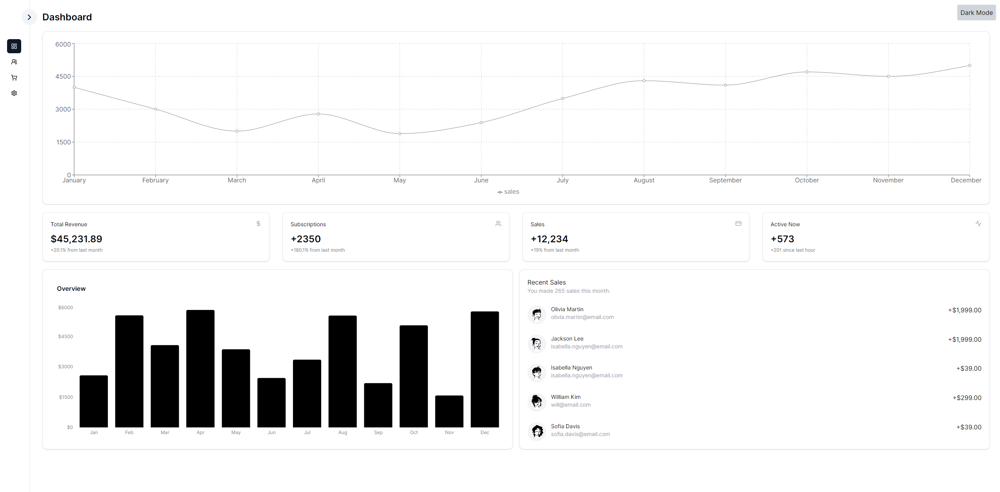

# <div align="center">Shadcn eCommerce Dashboard</div>


## About the Project

A fully comprehensive statistical dashboard for managin eCommerce websites built with [Next.js](https://nextjs.org/), styled using [Tailwind CSS](https://tailwindcss.com/).

## Features

- 🌐 **Single Page Application**: Seamless navigation and fast load times.
- 🎨 **Custom Tailwind CSS Styling**: Fully responsive and customizable design.
- 🧩 **Shadcn UI Components**: Beautifully designed UI components for enhanced user experience.
- 🚀 **Netlify Deployment**: Fast, secure, and reliable hosting with continuous deployment.

## Tech Stack

<div align="center">
  


</div>

## Project Structure
```bash
├───app
│   ├───orders
│   ├───settings
│   └───users
├───components
│   └───ui
├───lib
└───public
```

## Installation

To run this project locally, follow these steps:

1. **Clone the repository**
   ```bash
   git clone https://github.com/mabedd/Next-ShadcnUI-Dashboard.git

2. **Navigate to the project directory**
   ```bash
   cd Next-ShadcnUI-Dashboard

3. **Install Dependencies**
   ```bash
   npm install

4. **Start the App**
   ```bash
   npm run dev

<div align="center">
  <p>Made with ❤️ by Mohammed</p>
</div>
